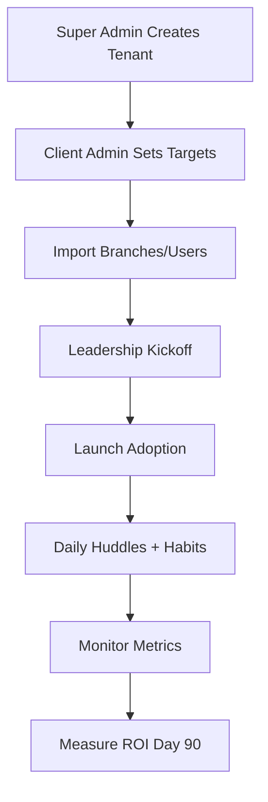
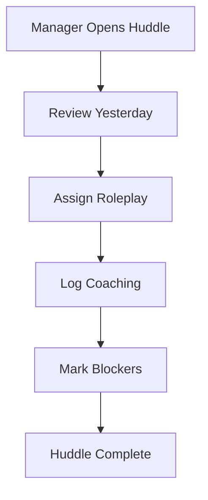
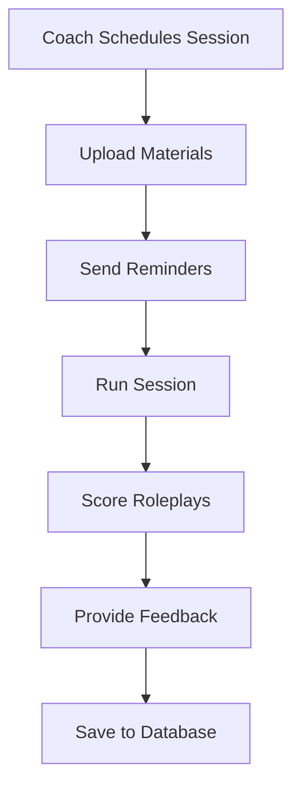

# E2E Service System - Workflows

## 1. 90-Day Pilot Workflow

### Day 0-7: Tenant Onboarding

**Super Admin Actions**:
1. Create tenant sub-account
2. Set subdomain (e.g., acme.e2e.com)
3. Assign billing plan (Starter/Growth/Enterprise)
4. Select "90-Day Pilot" template
5. Send welcome email to Client Admin

**Client Admin Actions**:
1. Receive welcome email, set password
2. Log in to tenant dashboard
3. Set pilot targets (e.g., -20% complaints, +2 CSAT)
4. Import branches (CSV or manual)
5. Import users (CSV or manual)
6. Assign roles (Manager, Coach, Staff, Executive Viewer)
7. Schedule kickoff meeting with leadership

### Day 8-14: Leadership Kickoff

**Client Admin Actions**:
1. Run kickoff meeting (use template agenda)
2. Log leadership commitments (timestamped)
3. Set accountability calendar (weekly check-ins)
4. Assign managers to branches

**Manager Actions**:
1. Receive welcome email
2. Log in, view branch dashboard
3. Review team roster
4. Download manager toolkit

### Day 15-30: Launch Adoption

**Manager Actions**:
1. Run first 15-minute huddle
   - Review yesterday's hits/misses
   - Assign one roleplay
   - Log coaching
   - Mark blockers
2. Repeat daily huddles
3. Assign micro-habits to team

**Coach Actions**:
1. Schedule first roleplay session
2. Upload materials (scenarios, rubrics)
3. Run session, score roleplays
4. Provide feedback

**Staff Actions**:
1. Complete daily micro-habit
2. Participate in roleplay
3. Attend huddles

### Day 31-60: Scale & Monitor

**Client Admin Actions**:
1. View org-wide dashboard (weekly)
2. Check branch variance
3. Review alerts (missed huddles, CSAT drops)
4. Export weekly reports

**Manager Actions**:
1. Continue daily huddles
2. Approve coaching logs
3. Monitor team adherence
4. Adjust coaching focus based on data

### Day 61-90: Measure ROI

**Client Admin Actions**:
1. Compare baseline vs current metrics
2. Export executive scorecard (PDF)
3. Review with leadership
4. Decide: scale to more branches or adjust

**Executive Viewer Actions**:
1. View executive scorecard
2. Review 3 wins, 3 risks, next 2 actions
3. Share with board/investors

---

## 2. Daily Manager Huddle (15 Minutes)

### Step 1: Review Yesterday (5 min)
- What went well? (hits)
- What didn't? (misses)
- Any customer complaints?

### Step 2: Assign Roleplay (3 min)
- Pick one scenario from library
- Assign to 2-3 staff
- Set deadline (today or tomorrow)

### Step 3: Log Coaching (5 min)
- Quick 1-tap form
- Staff name, topic, notes
- Optional: attach photo/video

### Step 4: Mark Blockers (2 min)
- Any issues preventing progress?
- Escalate to Client Admin if needed

---

## 3. Roleplay/Simulation Workflow

### Before Session
1. Coach schedules session
2. Selects scenario from library
3. Uploads materials (rubric, demo video)
4. Sends reminders to attendees (email/SMS)

### During Session
1. Staff perform roleplay (in pairs or with coach)
2. Coach scores using rubric (1-5 scale)
3. Coach provides instant feedback
4. Improvement tips logged

### After Session
1. Scores saved to database
2. Staff view scores and feedback
3. Manager reviews session report
4. Identify staff who need follow-up

---

## 4. Micro-Habit Completion Workflow

### Morning (8am)
1. Staff receives push notification
2. "Today's Habit: Greet 3 customers with a smile"

### During Shift
1. Staff completes habit
2. Optional: upload photo/video proof
3. Mark complete in app

### Evening
1. System calculates streak
2. Award badge if milestone (7, 14, 30 days)
3. Send congratulations notification

---

## 5. Coaching Log Workflow

### Manager Creates Log
1. Observe staff behavior during shift
2. Open app, tap "Log Coaching"
3. Fill form:
   - Staff name (dropdown)
   - Topic (e.g., "Tone of voice")
   - Notes (quick text)
   - Evidence (photo/video, optional)
4. Submit log

### Approval Flow
1. Log goes to Manager for approval
2. Manager reviews and approves/rejects
3. If approved, log is immutable
4. If rejected, coach can edit and resubmit

### Export for Audit
1. Client Admin or Manager exports logs (CSV)
2. All fields included (date, coach, staff, topic, notes, evidence)
3. Use for compliance audits

---

## 6. ROI Reporting Workflow

### Weekly
1. System calculates metrics:
   - CSAT average (last 7 days)
   - Complaints count (last 7 days)
   - Adoption % (habits completed, huddles run)
2. Compare to baseline
3. Update dashboards

### Monthly
1. System generates executive scorecard (PDF)
2. Includes:
   - KPI deltas (complaints %, CSAT points)
   - 3 wins (top-performing branches)
   - 3 risks (lagging branches, missed huddles)
   - Next 2 actions (recommendations)
3. Email to Client Admin and Executive Viewers

### End of Pilot (Day 90)
1. Final comparison: baseline vs current
2. Calculate ROI:
   - Complaints reduction %
   - CSAT improvement (points)
   - Repeat customer ratio change
3. Export final report (PDF)
4. Client Admin reviews with leadership
5. Decision: scale or adjust

---

## 7. Alert & Notification Workflow

### Trigger Conditions
- Habit completion < 70% for 7 days
- CSAT drops ≥ 2 points
- Manager misses 2+ huddles
- Branch variance in bottom 3

### Alert Flow
1. System detects condition
2. Creates alert record in database
3. Sends notification:
   - Email to Client Admin and Manager
   - SMS (if enabled)
   - In-app notification
4. Alert status: Active
5. When resolved, status: Resolved

### Smart Nudges
- "Missed 2 huddles this week. Run one today?"
- "Branch CSAT down 2 pts. Review coaching logs."
- "3 staff haven't completed habits in 5 days. Follow up?"

---

## 8. Branch Variance Analysis Workflow

### Daily Calculation
1. System aggregates metrics by branch:
   - CSAT average
   - Complaints count
   - Adoption % (habits, huddles, roleplays)
2. Calculate composite score (0-100)
3. Rank branches (1st, 2nd, 3rd, etc.)

### Color Coding
- Green: Top 3 branches (score ≥ 80)
- Yellow: Middle branches (score 60-79)
- Red: Bottom 3 branches (score < 60)

### Dashboard Display
1. Heatmap view (all branches)
2. Click branch to see details
3. Export to CSV

### Action Items
1. Client Admin reviews variance weekly
2. Identifies lagging branches
3. Assigns additional coaching or resources
4. Monitors improvement

---

## 9. Integration Workflows (Phase 2/3)

### CSAT Sync (Zendesk/Freshdesk)
1. Client Admin connects integration
2. Provides API key
3. System syncs CSAT surveys (daily)
4. Auto-imports to metrics table
5. Updates dashboards

### HRIS Sync (Azure AD/Google)
1. Client Admin enables SSO
2. System syncs users (daily)
3. Auto-creates/updates user accounts
4. Assigns roles based on directory groups

### Calendar Sync (Google/Microsoft)
1. Coach schedules session in E2E
2. System creates calendar event
3. Sends invites to attendees
4. Syncs updates (reschedule, cancel)

---

## 10. Billing Workflow (Phase 2)

### Subscription Creation
1. Super Admin assigns plan to tenant
2. System creates Stripe subscription
3. Sends invoice to Client Admin
4. Payment processed automatically

### Usage Tracking
1. System tracks usage daily:
   - Active users
   - SMS credits used
   - Storage used (GB)
2. If usage exceeds plan limits:
   - Send warning notification
   - Offer upgrade to higher plan

### Payment Failed
1. Stripe webhook notifies system
2. System updates tenant status: Suspended
3. Send email to Client Admin
4. Tenant has read-only access
5. After 7 days, tenant status: Cancelled

---

## 11. Data Export Workflow

### CSV Export
1. User clicks "Export" button
2. System queries database (filtered by tenant_id)
3. Generates CSV file
4. Downloads to user's device

### PDF Export (Executive Scorecard)
1. System queries metrics (last 30 days)
2. Renders PDF template (Puppeteer or PDFKit)
3. Includes:
   - KPI deltas
   - Branch variance chart
   - 3 wins, 3 risks, next 2 actions
4. Uploads to S3
5. Sends email with PDF link

### Scheduled Reports
1. Client Admin schedules monthly report
2. System runs cron job (1st of month)
3. Generates report (PDF)
4. Emails to Client Admin and Executive Viewers

---

## 12. Tenant Lifecycle Workflow

### Active
- Full access to platform
- Billing active
- All features enabled

### Suspended (Payment Overdue)
- Read-only access
- Cannot create new sessions/habits
- Cannot log coaching
- Billing reminder sent daily

### Cancelled (After 7 Days Suspended)
- No access to platform
- Data retained for 30 days
- Final invoice sent

### Deleted (After 30 Days Cancelled)
- All data permanently deleted
- Cannot be recovered
- Tenant record archived

---

## 13. Workflow Diagrams (Mermaid)

### 90-Day Pilot Flow

### Daily Huddle Flow

### Roleplay Flow

