# E2E Service System - Workflow Diagrams

## 1. Full Project Workflow (90-Day Pilot)

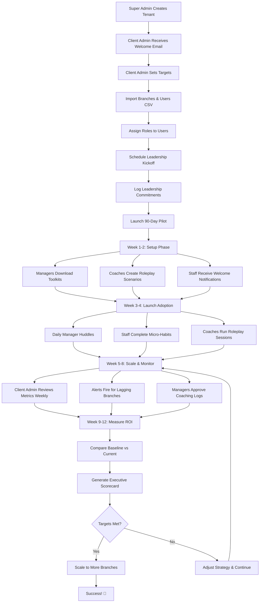

---

## 2. Super Admin Workflow

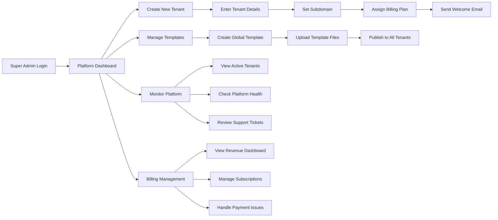

---

## 3. Client Admin Workflow

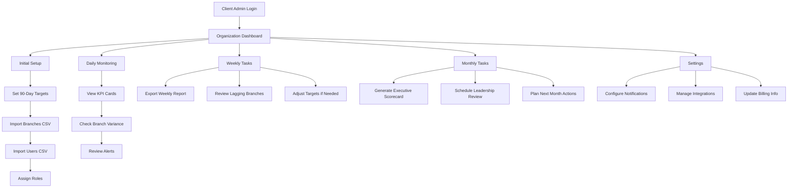

---

## 4. Manager Workflow

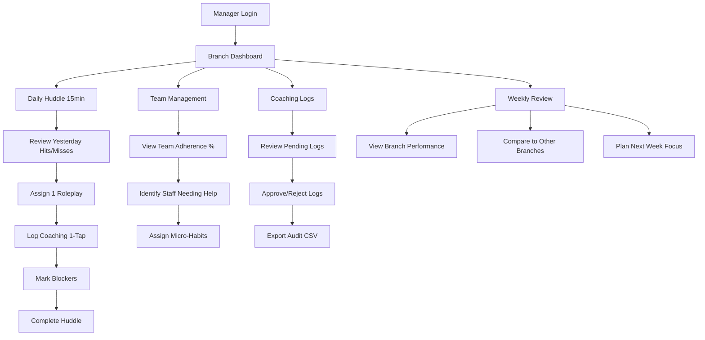

---

## 5. Coach/Trainer Workflow

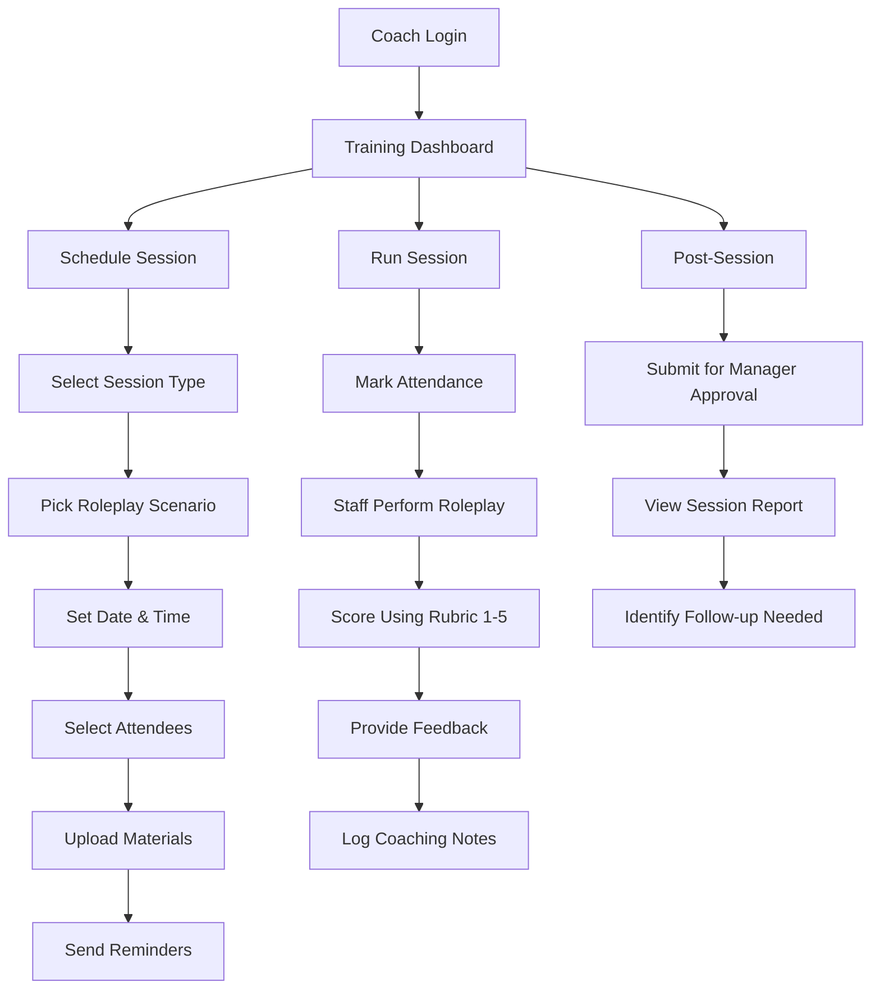

---

## 6. Staff Workflow

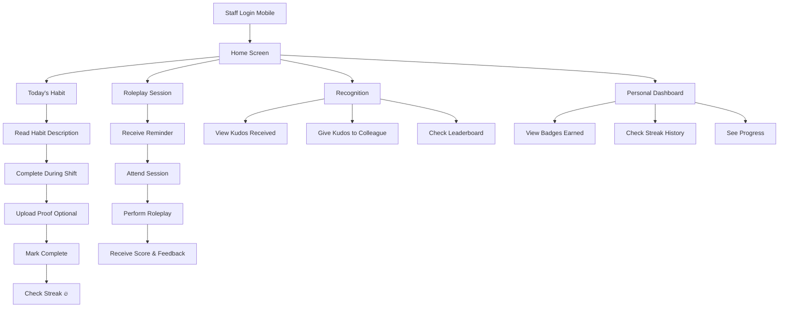

---

## 7. Executive Viewer Workflow

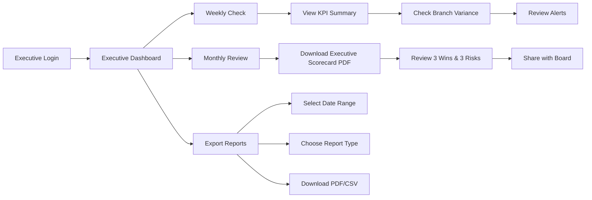

---

## 8. Daily Huddle Workflow (Manager)

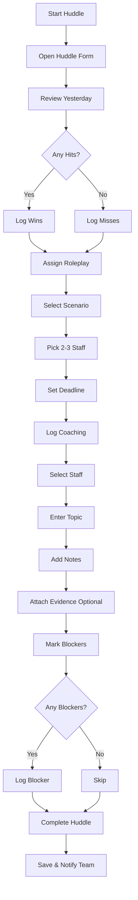

---

## 9. Micro-Habit Completion Workflow (Staff)

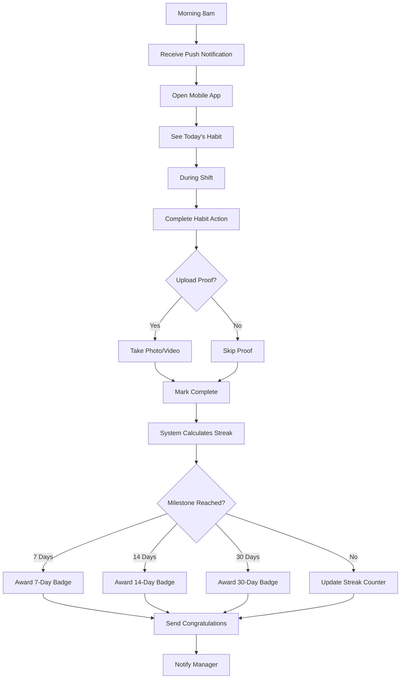

---

## 10. Roleplay Scoring Workflow (Coach)

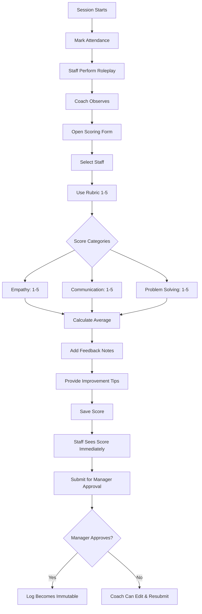

---

## 11. Alert & Notification Workflow

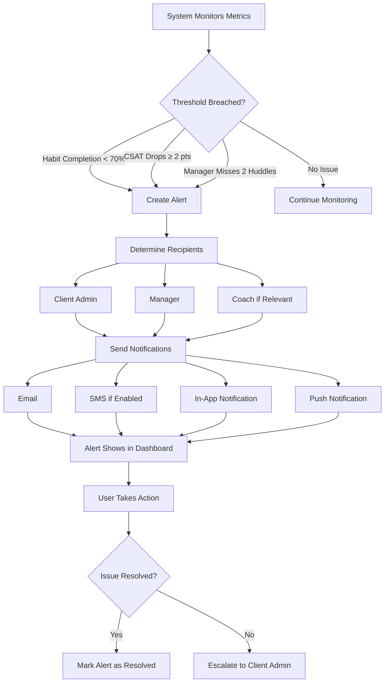

---

## 12. Branch Variance Calculation Workflow

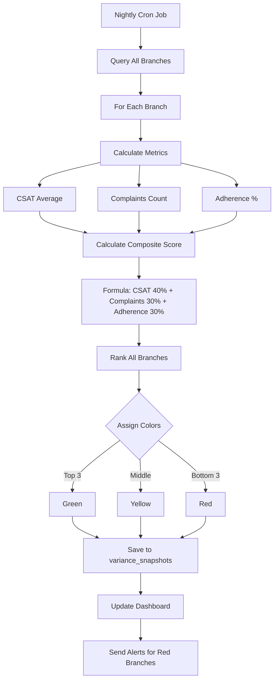

---

## 13. Data Flow: Metrics Import to Dashboard

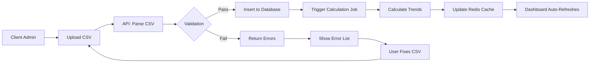

---

## 14. Integration Sync Workflow (CSAT from Zendesk)

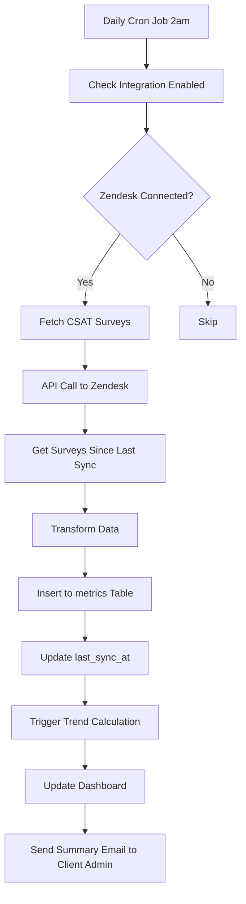

---

## 15. Tenant Lifecycle Workflow

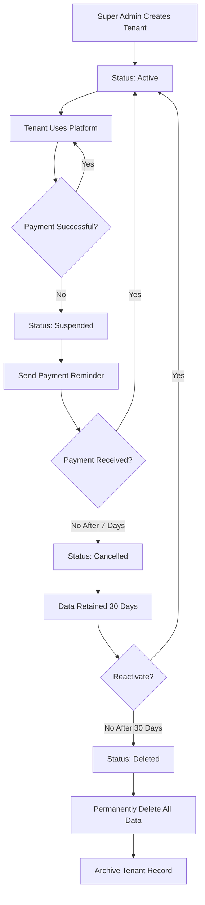
