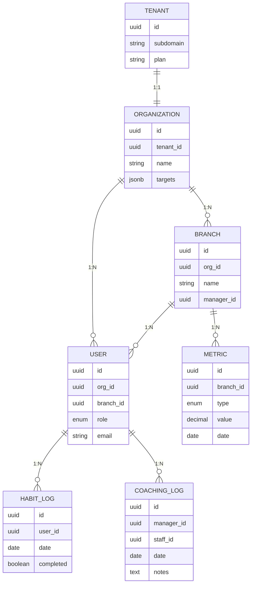
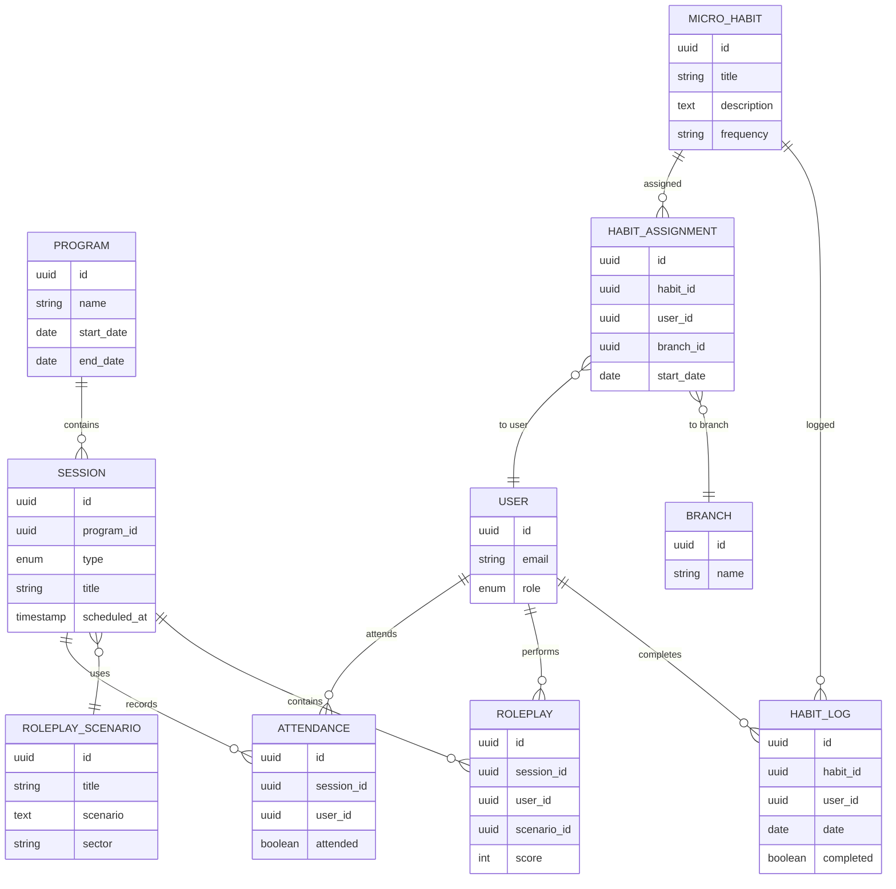
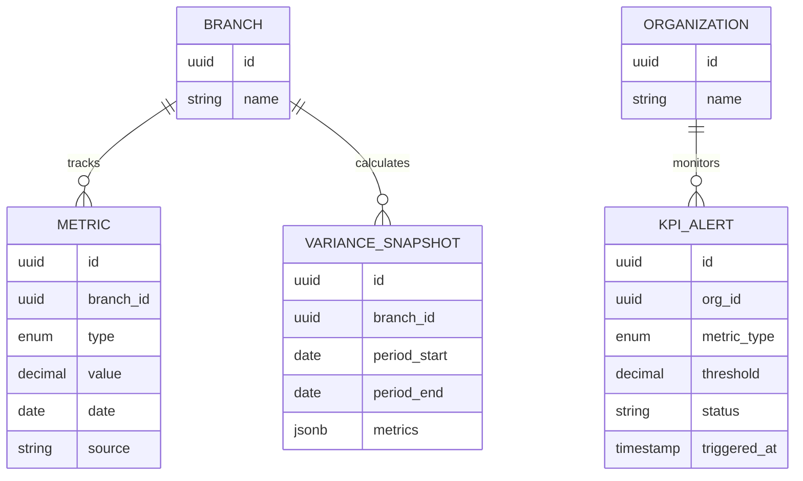
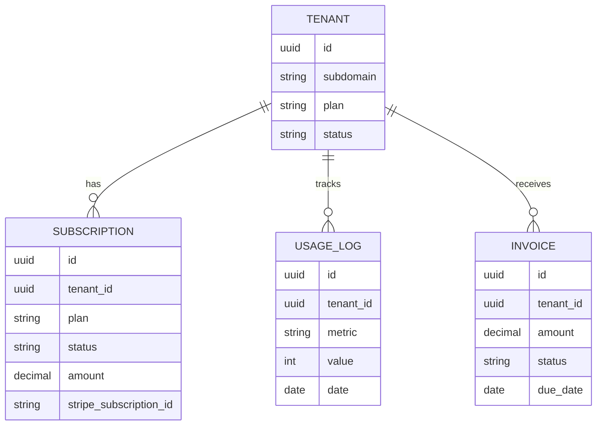
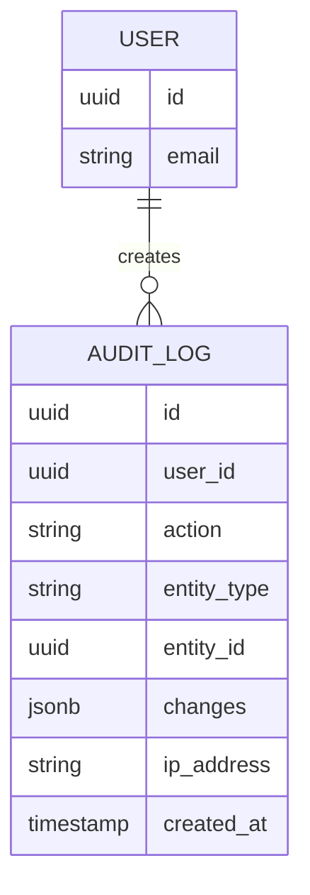

# E2E Service System - Entity Relationship Diagram (ERD)

## 1. Complete ERD (Mermaid)

```mermaid
erDiagram
    TENANT ||--|| ORGANIZATION : has
    TENANT ||--o{ SUBSCRIPTION : has
    TENANT ||--o{ USAGE_LOG : tracks
    
    ORGANIZATION ||--o{ BRANCH : contains
    ORGANIZATION ||--o{ USER : employs
    ORGANIZATION ||--o{ PROGRAM : runs
    ORGANIZATION ||--o{ MICRO_HABIT : creates
    ORGANIZATION ||--o{ KPI_ALERT : monitors
    
    BRANCH ||--o{ USER : assigns
    BRANCH ||--o{ SESSION : hosts
    BRANCH ||--o{ METRIC : tracks
    BRANCH }o--|| USER : "managed by"
    
    USER ||--o{ SESSION : facilitates
    USER ||--o{ ATTENDANCE : attends
    USER ||--o{ ROLEPLAY : performs
    USER ||--o{ HABIT_LOG : completes
    USER ||--o{ COACHING_LOG : "coaches/receives"
    USER ||--o{ RECOGNITION : "gives/receives"
    
    PROGRAM ||--o{ SESSION : includes
    
    SESSION ||--o{ ATTENDANCE : records
    SESSION ||--o{ ROLEPLAY : contains
    SESSION }o--|| ROLEPLAY_SCENARIO : uses
    
    MICRO_HABIT ||--o{ HABIT_ASSIGNMENT : assigned
    MICRO_HABIT ||--o{ HABIT_LOG : logged
    
    HABIT_ASSIGNMENT }o--|| USER : "assigned to"
    HABIT_ASSIGNMENT }o--|| BRANCH : "assigned to"
    
    COACHING_LOG }o--|| USER : "coach"
    COACHING_LOG }o--|| USER : "staff"
    
    RECOGNITION }o--|| USER : "from"
    RECOGNITION }o--|| USER : "to"
    
    TEMPLATE ||--o{ PROGRAM : "used by"
    
    TENANT {
        uuid id PK
        string name
        string subdomain UK
        string plan
        string status
        string locale
        string timezone
        timestamp created_at
        timestamp updated_at
    }
    
    ORGANIZATION {
        uuid id PK
        uuid tenant_id FK
        string name
        string industry
        jsonb targets
        jsonb baseline_metrics
        timestamp created_at
        timestamp updated_at
    }
    
    BRANCH {
        uuid id PK
        uuid tenant_id FK
        uuid org_id FK
        string name
        string region
        uuid manager_id FK
        int staff_count
        timestamp created_at
        timestamp updated_at
    }
    
    USER {
        uuid id PK
        uuid tenant_id FK
        uuid org_id FK
        uuid branch_id FK
        enum role
        string email UK
        string password_hash
        string first_name
        string last_name
        string phone
        string status
        timestamp last_login_at
        timestamp created_at
        timestamp updated_at
    }
    
    PROGRAM {
        uuid id PK
        uuid tenant_id FK
        uuid org_id FK
        uuid template_id FK
        string name
        date start_date
        date end_date
        jsonb targets
        string status
        timestamp created_at
        timestamp updated_at
    }
    
    SESSION {
        uuid id PK
        uuid tenant_id FK
        uuid program_id FK
        uuid branch_id FK
        enum type
        string title
        text agenda
        timestamp scheduled_at
        int duration_min
        uuid facilitator_id FK
        jsonb materials
        string status
        timestamp created_at
        timestamp updated_at
    }
    
    ATTENDANCE {
        uuid id PK
        uuid tenant_id FK
        uuid session_id FK
        uuid user_id FK
        boolean attended
        text notes
        timestamp created_at
    }
    
    ROLEPLAY_SCENARIO {
        uuid id PK
        uuid tenant_id FK
        string title
        text scenario
        string sector
        enum difficulty
        int duration_min
        string video_url
        timestamp created_at
        timestamp updated_at
    }
    
    ROLEPLAY {
        uuid id PK
        uuid tenant_id FK
        uuid session_id FK
        uuid user_id FK
        uuid scenario_id FK
        int score
        text coach_notes
        string video_url
        timestamp created_at
    }
    
    MICRO_HABIT {
        uuid id PK
        uuid tenant_id FK
        uuid org_id FK
        string title
        text description
        string frequency
        int points
        timestamp created_at
        timestamp updated_at
    }
    
    HABIT_ASSIGNMENT {
        uuid id PK
        uuid habit_id FK
        uuid user_id FK
        uuid branch_id FK
        uuid assigned_by FK
        date start_date
        date end_date
        timestamp created_at
    }
    
    HABIT_LOG {
        uuid id PK
        uuid tenant_id FK
        uuid habit_id FK
        uuid user_id FK
        date date
        boolean completed
        string proof_url
        timestamp created_at
    }
    
    COACHING_LOG {
        uuid id PK
        uuid tenant_id FK
        uuid manager_id FK
        uuid staff_id FK
        date date
        string topic
        text notes
        string evidence_url
        boolean approved
        uuid approved_by FK
        timestamp created_at
    }
    
    RECOGNITION {
        uuid id PK
        uuid tenant_id FK
        uuid from_user_id FK
        uuid to_user_id FK
        string tag
        text note
        timestamp created_at
    }
    
    METRIC {
        uuid id PK
        uuid tenant_id FK
        uuid branch_id FK
        enum type
        decimal value
        date date
        string source
        timestamp created_at
    }
    
    KPI_ALERT {
        uuid id PK
        uuid tenant_id FK
        uuid org_id FK
        enum metric_type
        decimal threshold
        string status
        timestamp triggered_at
        timestamp resolved_at
        timestamp created_at
    }
    
    TEMPLATE {
        uuid id PK
        string name
        string type
        jsonb content
        boolean is_global
        uuid created_by FK
        timestamp created_at
    }
    
    SUBSCRIPTION {
        uuid id PK
        uuid tenant_id FK
        string plan
        string status
        string billing_cycle
        decimal amount
        string stripe_subscription_id
        date current_period_start
        date current_period_end
        timestamp created_at
    }
    
    USAGE_LOG {
        uuid id PK
        uuid tenant_id FK
        string metric
        int value
        date date
        timestamp created_at
    }
```



---

## 2. Core Entities ERD (Simplified)



---

## 3. Training & Adoption ERD



---

## 4. Metrics & Analytics ERD



---

## 5. Billing & Subscriptions ERD



---

## 6. Relationships Summary

### One-to-One (1:1)
- Tenant → Organization

### One-to-Many (1:N)
- Organization → Branch
- Organization → User
- Organization → Program
- Branch → User
- Branch → Session
- Branch → Metric
- User → HabitLog
- User → Roleplay
- User → Attendance
- Session → Attendance
- Session → Roleplay
- MicroHabit → HabitLog
- Program → Session

### Many-to-One (N:1)
- Branch → User (manager)
- Session → User (facilitator)
- Roleplay → RoleplayScenario
- HabitAssignment → User
- HabitAssignment → Branch
- CoachingLog → User (coach)
- CoachingLog → User (staff)

### Many-to-Many (M:N)
- User ↔ Session (via Attendance)
- MicroHabit ↔ User (via HabitAssignment)
- MicroHabit ↔ Branch (via HabitAssignment)

---

## 7. Key Constraints

### Primary Keys
- All tables use UUID as primary key
- Format: `id UUID PRIMARY KEY DEFAULT gen_random_uuid()`

### Foreign Keys
- All foreign keys reference parent table's `id`
- Cascade delete where appropriate (e.g., Organization → Branch)
- Set NULL for optional relationships (e.g., User → Branch)

### Unique Constraints
- `tenants.subdomain` (unique across platform)
- `users.email` (unique per tenant: `UNIQUE(tenant_id, email)`)

### Check Constraints
- `roleplay.score` (1-5 range)
- `metric.value` (positive decimal)
- `subscription.amount` (positive decimal)

### Indexes
- `tenant_id` on all tenant-scoped tables
- `org_id` on organization-scoped tables
- `branch_id` on branch-scoped tables
- `user_id` on user-scoped tables
- `date` on time-series tables (metrics, habit_logs)
- Composite indexes: `(tenant_id, email)`, `(tenant_id, branch_id)`, etc.

---

## 8. Data Isolation Strategy

### Row-Level Security (RLS)
```sql
-- Enable RLS on all tenant-scoped tables
ALTER TABLE organizations ENABLE ROW LEVEL SECURITY;
ALTER TABLE branches ENABLE ROW LEVEL SECURITY;
ALTER TABLE users ENABLE ROW LEVEL SECURITY;

-- Create policy
CREATE POLICY tenant_isolation ON organizations
  USING (tenant_id = current_setting('app.current_tenant')::UUID);
```

### Tenant Context
Every query must include `tenant_id` filter:
```sql
SELECT * FROM users WHERE tenant_id = 'xxx' AND email = 'user@example.com';
```

---

## 9. Audit Trail

### Audit Log Table


### Tracked Actions
- CREATE: New record created
- UPDATE: Record modified
- DELETE: Record soft-deleted
- LOGIN: User logged in
- EXPORT: Data exported

---

## 10. Soft Delete Pattern

All tables include `deleted_at` timestamp:
```sql
deleted_at TIMESTAMP NULL
```

Queries filter out deleted records:
```sql
SELECT * FROM users WHERE tenant_id = 'xxx' AND deleted_at IS NULL;
```

---

## 11. JSON Fields

### targets (Organization, Program)
```json
{
  "complaints": -20,
  "csat": 2,
  "adoption": 80
}
```

### baseline_metrics (Organization)
```json
{
  "complaints": 50,
  "csat": 3.5,
  "repeat_customers": 0.6
}
```

### materials (Session)
```json
[
  {"name": "slides.pdf", "url": "https://..."},
  {"name": "video.mp4", "url": "https://..."}
]
```

### metrics (VarianceSnapshot)
```json
{
  "csat_avg": 4.2,
  "complaints_count": 15,
  "adherence_pct": 85,
  "rank": 1
}
```

---

## 12. Enums

```sql
-- User roles
CREATE TYPE user_role AS ENUM (
  'SuperAdmin',
  'ClientAdmin',
  'Manager',
  'Coach',
  'Staff',
  'ExecutiveViewer'
);

-- Session types
CREATE TYPE session_type AS ENUM (
  'Huddle',
  'Roleplay',
  'Clinic',
  'Workshop'
);

-- Metric types
CREATE TYPE metric_type AS ENUM (
  'CSAT',
  'Complaints',
  'RepeatCustomer',
  'TimeToResolve'
);

-- Difficulty levels
CREATE TYPE difficulty_level AS ENUM (
  'Easy',
  'Medium',
  'Hard'
);
```
